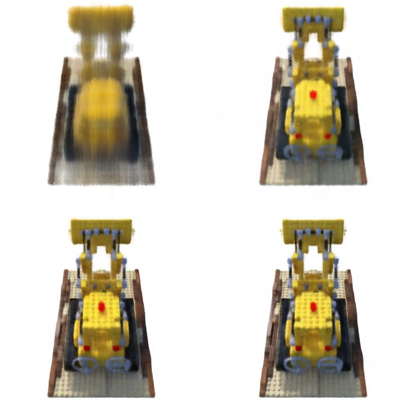

# NeRF_Pytorch_

Pytorch re-implementation of [NeRF](http://www.matthewtancik.com/nerf) (Neural Radiance Fields)

## Environment

## Training

## Results

- quantitative results 

| date  | exp   | model                 | Batch size     | # params   | PSNR   | SSIM   | loss   | Time | 
|-------|-------|-----------------------|----------------|------------|--------|--------|--------| -----|
| 07.27 | 1     | coarse(64)            | 1024           |6235582     |0.9163  |0.2613  | 0.1133 | 12s  |
| 07.28 | 2     | coarse(64) + fine(64) | 4096           |6235402     |0.9097  |0.2757  | 0.1133 | 12s  |
| 07.29 | 3     | coarse(64) + fine(128)| 4096           |6235402     |0.9097  |0.2757  | 0.1133 | 12s  |

- qualitative results

left top to right down 1000/ 50000/ 100000/ 150000 step

### TODO LIST

- [ ] Rendering
- [x] README.md
- [ ] quick start 
- [x] demonstrate render processing
- [ ] performance

