# NeRF_Pytorch_

Pytorch re-implementation of [NeRF](http://www.matthewtancik.com/nerf) (Neural Radiance Fields)

## Environment

## Training

- batch : 1024 (gtx 1080ti) due to 
- loss : MSE
- dataset : Realistic Synthetic 360
- iterations : 300k
- optimizer : Adam
- init lr : 5e-4
- scheduler : CosineAnnealingLR (upto 5e-5) + warmup(10k)
- network init : xavier for stability 

## Results

- quantitative results (official)

| data          |  model             | Batch size     | resolution |  PSNR   |  SSIM  | LPIPS  | 
|---------------|--------------------|----------------|------------|---------|--------|--------|
| chair         | Hierarchical       | 4096           | 800 x 800  | 33.0000 | 0.9670 | 0.0460 | 
| drums         | Hierarchical       | 4096           | 800 x 800  | 25.0100 | 0.9250 | 0.0910 | 
| ficus         | Hierarchical       | 4096           | 800 x 800  | **30.1300** | **0.9640** | **0.0440** | 
| hotdog        | Hierarchical       | 4096           | 800 x 800  | 36.1800 | 0.9740 | 0.1210 | 
| lego          | Hierarchical       | 4096           | 800 x 800  | **32.5400** | 0.9610 | 0.0500 | 
| materials     | Hierarchical       | 4096           | 800 x 800  | 29.6200 | 0.9490 | 0.0630 | 
| mic           | Hierarchical       | 4096           | 800 x 800  | 32.9100 | 0.9800 | 0.0280 | 
| ship          | Hierarchical       | 4096           | 800 x 800  | 28.6500 | 0.8560 | 0.2060 | 
| mean          | Hierarchical       | 4096           | 800 x 800  | 31.0100 | 0.9470 | 0.0810 | 

- quantitative results (this repo)

| data          | model              | Batch size     | resolution |  PSNR   |  SSIM  | LPIPS  | 
|---------------|--------------------|----------------|------------|---------|--------|--------|
| chair         | Hierarchical       | 1024           | 400 x 400  | **34.8707** | **0.9790** | **0.0280** | 
| drums         | Hierarchical       | 1024           | 400 x 400  | **25.6536** | **0.9292** | **0.0769** | 
| ficus         | Hierarchical       | 1024           | 400 x 400  | 29.3877 | 0.9643 | 0.0447 | 
| hotdog        | Hierarchical       | 1024           | 400 x 400  | **37.3367** | **0.9809** | **0.0294** | 
| lego          | Hierarchical       | 1024           | 400 x 400  | 31.7081 | **0.9636** | **0.0386** | 
| materials     | Hierarchical       | 1024           | 400 x 400  | **29.8234** | **0.9570** | **0.0535** | 
| mic           | Hierarchical       | 1024           | 400 x 400  | **33.8926** | **0.9803** | **0.0239** | 
| ship          | Hierarchical       | 1024           | 400 x 400  | **29.6258** | **0.8762** | **0.1342** | 
| mean          | Hierarchical       | 1024           | 400 x 400  | **31.5373** | **0.9538** | **0.0537** | 

- For most classes, our repo performed slightly better that original papers.

- we think it because the differences which are network init, resolution(batch size), and warm up training

- qualitative results

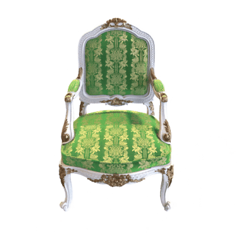

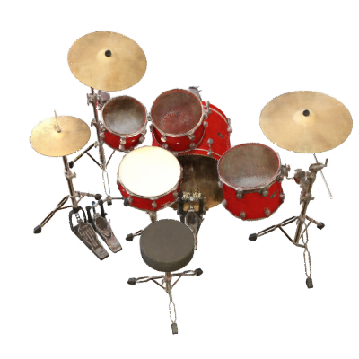
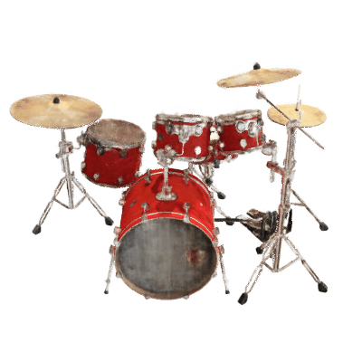

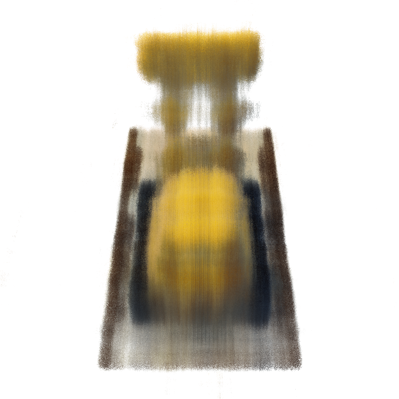
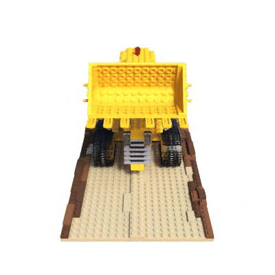

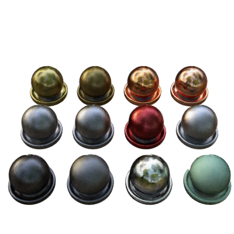
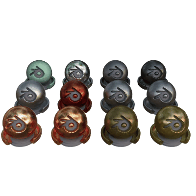

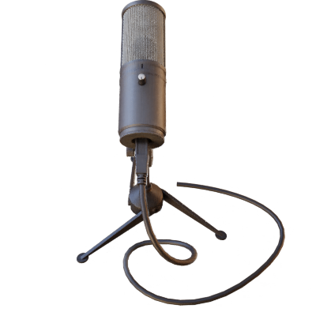
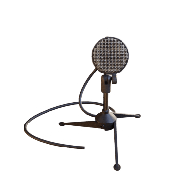

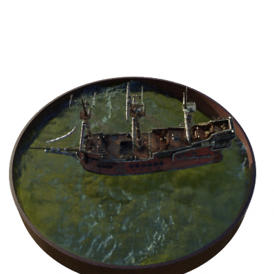
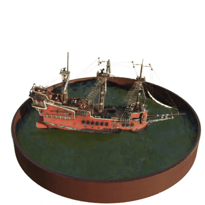

### TODO LIST

- [x] README.md
- [x] Make coarse + fine network 
- [x] Demonstrate render processing
- [x] scheduler
- [x] Half version 
- [x] Measure performance ssim, psnr and lpips
- [x] Rendering
- [ ] Other dataset [LIFF]
- [ ] Quick start 

